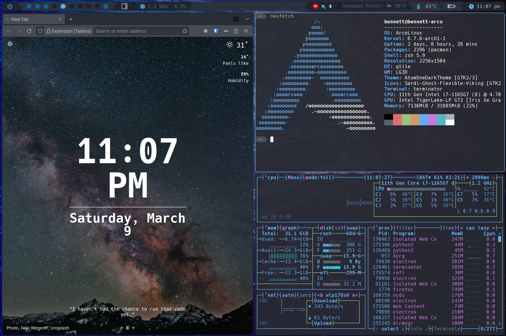

<!--
*** This readme is inspired by the Best-README-Template available at https://github.com/othneildrew/Best-README-Template. Thanks to othneildrew for the inspiration!
-->

<!-- PROJECT SHIELDS -->
<!--
*** I'm using markdown "reference style" links for readability.
*** Reference links are enclosed in brackets [ ] instead of parentheses ( ).
*** See the bottom of this document for the declaration of the reference variables
*** for contributors-url, forks-url, etc. This is an optional, concise syntax you may use.
*** https://www.markdownguide.org/basic-syntax/#reference-style-links
-->
[![Stargazers][stars-shield]][stars-url]
[![Issues][issues-shield]][issues-url]

<!-- PROJECT LOGO -->
 

  <!-- TODO Add logo here -->
  <!--  -->

  <h1 align="center">Dotfiles</h3>

  

    This repository serves as a backup for all of my configuration files for my Arch Linux system that I use on a daily basis. It also houses a few bash scripts I have written to aid in the install process of both these configs and a full Arch system.
     
    <a href="https://github.com/bennett-wendorf/dotfiles"><strong>Explore the docs »</strong></a>
     
     
    <a href="https://github.com/bennett-wendorf/dotfiles/issues">Report Bug</a>
    ·
    <a href="https://github.com/bennett-wendorf/dotfiles/issues">Request Feature</a>
  

<!-- TABLE OF CONTENTS -->

  
Table of Contents

  <ol>
    <li>
      <a href="#about-the-project">About The Project</a>
      <ul>
        <li><a href="#built-with">Built With</a></li>
      </ul>
    </li>
    <li>
      <a href="#getting-started">Getting Started</a>
      <ul>
        <li><a href="#config-file-installation">Config File Installation</a></li>
        <li><a href="#full-arch-system-installation">Full Arch System Installation</a></li>
      </ul>
    </li>
    <li><a href="#contributing">Contributing</a></li>
    <li><a href="#license">License</a></li>
    <li><a href="#contact">Contact</a></li>
    <li><a href="#acknowledgements">Acknowledgements</a></li>
  </ol>

<!-- ABOUT THE PROJECT -->
## About The Project

This project began in the summer of 2020 when I decided to jump ship from Windows and move to GNU/Linux full time on my main system. When I started out, I fell in love with customizing, or 'ricing,' my system. Because of this, I needed a safe place to store all my config files that I was creating. Thus, this repository was born. Now that I've been on Linux for over a year, I decided to start working on some installation scripts to make the process of reinstalling my system easier. Check out the [Getting Started](#getting-started) section of this page. Enjoy!

### Built With

This project is written in a variety of languages and configurations as it is a full compilation 
of the config files I use on my Arch linux system on a daily basis.

<!-- GETTING STARTED -->
## Getting Started

### NOTE:
Regardless of the method chosen, you'll need to set up the `.xprofile-template` file to make everything work properly. Take the included template (`.xprofile-tempate`) and rename it to `.xprofile`. Then, inside that file, fill in the details with your API keys for Open Weather Map and IP Info. Both are totally free to sign up for :)

There are three main ways you can utilize this repository. The first and maybe simplist is to just grab the configs that you want from here and paste them into your own dirctories. Alternatively, I have created scripts to either help you just [install the config files](#config-file-installation), or to [install a full Arch Linux system](#full-arch-system-installation) from the ground up. For either of these methods, clone this repo, navigate into the ArchInstall directory, and run the appropriate script.

### Config File Installation

The most basic way to just install my config files is to just run the `install_configs.sh` script. This will ensure my configs have been downloaded, back up any of your configs, and then install my. See the `.old` files and directories for the backed up files. The other alternative if you want all of the apps to be installed as well is to run the `install_basic_apps.sh` script to install all of the apps that I use before installing the configs. NOTE: Running the `install_basic_apps.sh` script will also run the `install_configs.sh` script, so no need to run it again.

### Full Arch System Installation

If you would like to use my scripts to install a full Arch Linux system from the ground up, you can do so by following the guide that I will be working on in the wiki section of this repository. For now, that is a work in progress, but the gist of it is you should install up to the point where you chroot into the new system, and then clone this repository and run the `install_full_system.sh` script to finish the install.

<!-- CONTRIBUTING -->
## Contributing

Contributions are what make the open source community such an amazing place to be learn, inspire, and create. Any contributions you make are **greatly appreciated**.

1. Fork the Project
2. Create your Feature Branch (`git checkout -b feature/AmazingFeature`)
3. Commit your Changes (`git commit -m 'Add some AmazingFeature'`)
4. Push to the Branch (`git push origin feature/AmazingFeature`)
5. Open a Pull Request

If you find an issue in existing code, feel free to use the above procedure to generate a change, or open an [issue](https://github.com/Bennett-Wendorf/dotfiles/issues) for me to fix it.

<!-- LICENSE -->
## License

Most of this repository is distributed under the MIT License with a few exceptions. 
See `LICENSE` for more information.

<!-- CONTACT -->
## Contact

Bennett Wendorf - [Website](https://bennett-wendorf.github.io/) - bennettwendorf@gmail.com

Project Link: [https://github.com/Bennett-Wendorf/dotfiles](https://github.com/Bennett-Wendorf/dotfiles)

<!-- ACKNOWLEDGEMENTS -->
## Acknowledgements
* [Img Shields](https://shields.io)
* [Ole Martin Handeland](https://github.com/olemartinorg) for his work on [i3-alternating-layouts](https://github.com/olemartinorg/i3-alternating-layout)
* User MaTachi on the Arch Linux forum for [this](https://bbs.archlinux.org/viewtopic.php?pid=1484947#p1484947) forum post
* [Unsplash](https://unsplash.com/) and [DT's wallpaper repo](https://gitlab.com/dwt1/wallpapers) for many of the wallpapers
* [Sam1431](https://github.com/Sam1431) and their repo [NixSome](https://github.com/Sam1431/NixSome) for some of the basis of my AwesomeWM configs
* [Pavel Makhov](https://pavelmakhov.com/awesome-wm-widgets) for some additional AwesomeWM widgets
* The [ArcoLinux Team](https://arcolinux.com/) for some ideas and the basis of my Qtile configs as well as the battery widget
* [adi1090x](https://github.com/adi1090x) for their [repo](https://github.com/adi1090x/rofi) that I use for my rofi configs with only a few slight modifications
* [Dribbblish Spicetify Themes](https://github.com/morpheusthewhite/spicetify-themes/tree/master/Dribbblish) with only some small color changes

<!-- * [GitHub Pages](https://pages.github.com) -->

<!-- MARKDOWN LINKS & IMAGES -->
<!-- https://www.markdownguide.org/basic-syntax/#reference-style-links -->
[forks-shield]: https://img.shields.io/github/forks/bennett-wendorf/dotfiles.svg?style=flat
[forks-url]: https://github.com/bennett-wendorf/dotfiles/network/members
[stars-shield]: https://img.shields.io/github/stars/bennett-wendorf/dotfiles.svg?style=flat&color=yellow
[stars-url]: https://github.com/bennett-wendorf/dotfiles/stargazers
[issues-shield]: https://img.shields.io/github/issues/bennett-wendorf/dotfiles.svg?style=flat&color=red
[issues-url]: https://github.com/bennett-wendorf/dotfiles/issues
[license-shield]: https://img.shields.io/github/license/bennett-wendorf/dotfiles.svg?style=flat
[license-url]: https://github.com/bennett-wendorf/dotfiles/blob/master/LICENSE
